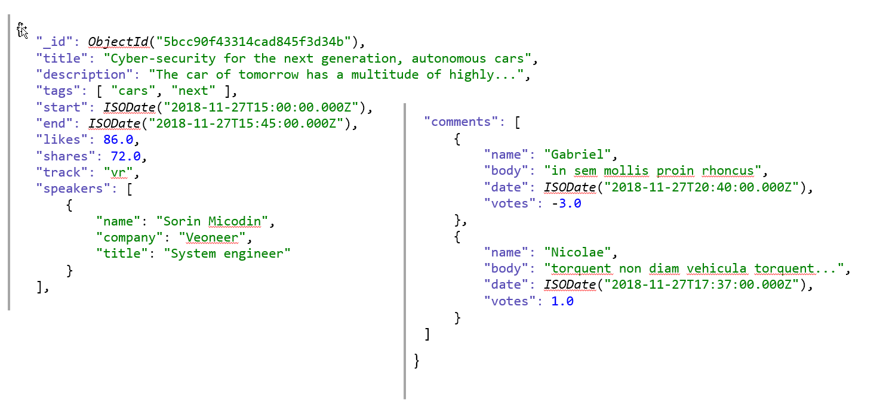

# Queries

Connect to mongo using a client
- use a Mongodb visual interface like [Studio 3T](https://studio3t.com/free/)
- or run `mongosh` command in [console](https://docs.mongodb.com/mongodb-shell/#mongodb-binary-bin.mongosh)

Show available databases
```javascript
show dbs
```

Use the database called "db2" (or other db name you were given)
```javascript
use db2
```

```javascript
db
```

Insert a simple document ( or db.createCollection() )


```javascript
db.test.insert({ a: 1, b: 2, c: "foo" })
```

View the results


```javascript
db.test.find()
```

List all collections


```javascript
show collections
```


Insert a more complex document


```javascript
db.test.insert({ a: 21, b: 22, d: { e :0.5, f: new Date() }})
```

```javascript
db.test.insert({ a: 31, b: 33, d: { e :0.6, f: new Date() }})
```

See the latest version of the collection


```javascript
db.test.find()
```

Count the objects in the collection test


```javascript
db.test.count()
```
(!) In Atlas free tier this throws a warning

See documents where a = 1


```javascript
db.test.find({a:1})
```

Same query but selecting only a,b fields, by default _id is always returned, you need to exclude it spacifically


```javascript
db.test.find({a:1},{a:1, b:1, _id:0})
```

Find with limit and offset
```javascript
db.test.find().limit(1).skip(1).sort({a:1})
```

## Query a real life database

Download agenda collection:
[zip](https://storage.googleapis.com/ansp-mongo-workshop/mongo/agenda.zip)

Import the agenda collection into the work database

- Using Studio 3T
  - copy archive into `mongo-workshop`
  - extract archive
  - Import -> select `mongo-workshop`
    - rename agenda to you db number (e.g. db2)
    - make sure destination host is correct
- Using Cli
  - `mongorestore --db=work --collection=agenda --archive=agenda.gz --gzip`
  - or: `mongoimport --db work --collection agenda --file agenda.json`

```javascript
show collections
```


```javascript
db.agenda.find().count()
```

## Collection schema



## Comparison operators
Syntax: {field:{$operator:value}}

- **\$gt**, **\$gte** - greater then (or equals) 
- **\$lt**, **\$lte** - lower than (or equals)
- **\$ne** - not equals
- **\$in** - value in an array
- **\$nin** - value does not exist in an array

1.1 Get all presentations with more than 96 likes
```javascript
db.agenda.find({'likes':{$gt:96}})
```
1.2 Get all presentations with less then or equals to 2 likes 
```javascript
db.agenda.find({'likes':{$lte:2}}, {title: 1, _id: 0})
```
1.3 Get all presentations that are not in the track "cloud" or "leadership"
```javascript
db.agenda.find({'track':{$nin:['cloud','leadership']}}).count()
```
1.4 Get all presentations that have comments written by Alexandra or Loredana 
```javascript
db.agenda.find({'comments.name':{$in:['Alexandra','Loredana']}}).count()
```
1.5 Count the presentations that have shares between 6 and 10 (exclusively) 
```javascript
db.agenda.find({'shares':{$gt:6, $lt:10}})
```


## Logical operators

- **\$and** - {\$and:[conditions]} - joins clauses with a logical AND operator (all conditions must be true)
- **\$or** - {\$or:[conditions]} - joins clauses with a logical OR operator (at least one condition must be true)
- **\$nor** - {\$nor:[conditions]} - returns the documents that fail to match both clauses
- **\$not** - {field: {\$not:{conditions}}} negates a query expression

2.1 Count the presentations that are on the 'cloud' track and have more than 20 likes
```javascript
db.agenda.find({track:'cloud', likes: {$gt:20}}).count()
```
equivalent
```javascript
db.agenda.find({$and: [{track:'cloud'}, {likes: {$gt:20}}]}).count()
```

2.2 Count the presentations that have more than 95 likes or more than 95 shares
```javascript
db.agenda.find({$or: [{likes: {$gt:95}}, {shares: {$gt:95}}]}).count()
```


## Element operations
- **\$exists** - {field:{\$exists:bool}} matches documents that have the specified field
- **[\$type](https://docs.mongodb.com/manual/reference/operator/query/type/#available-types)** - matches document with the specified type (integer - 2 = string, 1 = double...)

3.1 Count the presentations without descriptions
```javascript
db.agenda.find({description:{$exists:0}})
```

3.2 Count the presentations that have start field as date
```javascript
db.agenda.find({start:{$type:"date"}}).count()
```

3.3 What about the one that doesn't have start as date?
```javascript
db.agenda.find({start:{$not:{$type:"date"}}})
```


## Evaluation Operators

- **\$regex** - select documents that match the specified regular expression
- **\$mod** - performs a modulo on the values specified and returns the one who match the reminder - { field: { \$mod: [ divisor, remainder ] } }
- **\$text** - performs a text search - requires a text index { \$text: {\$search: \<string>,\$language: <string> \} \}
- **[\$where](https://docs.mongodb.com/manual/reference/operator/query/where/index.html)** - matches documents that satisfy a JavaScript expression

3.4 Get all presentations starting with "Keynote"

```javascript
db.agenda.find({title: { $regex: /^Keynote/, $options: 'i' } }, {title:1, _id: 0})
```
and equivalent

```javascript
db.agenda.find({title: /^Keynote/i }, {title:1, _id: 0})
```

3.5 Find all presentations with the same number of likes and shares

```javascript
db.agenda.find({$where: "this.likes == this.shares"}, {title:1, shares:1, likes:1})

db.agenda.find({$expr: {$eq:["$likes", "$shares"] }}, {title:1, shares:1, likes:1})
```
> queries with `$expr` operator can't use indexes, not even simple ones
> documentation [where](https://www.mongodb.com/docs/manual/reference/operator/query/where/), [expr](https://www.mongodb.com/docs/manual/reference/operator/query/expr/)

3.6 Find all presentations with the same number of likes and shares OR with more than 95 likes


```javascript
db.agenda.find({$where: "this.likes == this.shares || this.likes > 95"}, {title:1, shares:1, likes:1})

db.agenda.find({$expr: {$or:[{$eq:["$likes", "$shares"]},{$gt:["$likes", 95] } ] }}, {title:1, shares:1, likes:1})
```

3.7 Find all presentations with a word in a specific position


```javascript
db.agenda.find({$where: "function() { return (this.title.substring(2,6) == 'hate'); }"}, {title: 1})
```


## Array operators

- **\$all** - {field:{\$all:values}} - matches arrays that contain all elements from the query
- **\$elemMatch** - {field:{\$elemMatch:{subqueries}}} - matches documents if element in array mathes all conditions
- **\$size** - {field:{\$size:int}} - selects array keys with specified size

4.1 Find all presentations that have both tags "traffic" and "scale"


```javascript
db.agenda.find({'tags':{$all:["traffic","scale"]}})
```

This wouldn't work
```javascript
db.agenda.find({'tags':["traffic","scale"]})
```

It works only for an exact match
```javascript
db.agenda.find({'tags':["adaptive","software"]})
```

4.2 Get all presentation that have at least one comment by "Radu" and has 18 votes

You might think this works:
```javascript
db.agenda.find({"comments.name":"Radu", "comments.votes":18}, {"comments.name":1, "comments.votes":1, _id:0})
```

Using a simple query doesn't work as expected on arrays because searching in arrays works in 3 steps:
1. Find all documents matching first condition
2. Find all documents matching second condition
3. Find all documents that matched step 1 and 2

You have to use `$elemMatch` instead
```javascript
db.agenda.find({comments:{$elemMatch:{name:"Radu", votes:18}}})
```

4.3 Get all presentations that have at least one comment with votes between 9 and 10 votes (including)

This will also not work because it will include also the presentations with comments that have only less than 9 and more than 10 votes
```javascript
db.agenda.find({'comments.votes':{$gte: 9, $lte: 10}}).count()
```

This will work instead
```javascript
db.agenda.find({comments:{$elemMatch:{votes:{$gte: 9, $lte: 10}}}}).count()
```

4.4 Find all presentations having exctly 2 comments

```javascript
db.agenda.find({'comments':{$size: 2}}, {comments: 1, _id: 0})
```


## Projection Operators

- **\$** projects first element matched in an array
- **\$elemMatch** - projects the first in the array that matches the conditions (can be on multiple fields)
- **\$meta** (2.6) - {field : {\$meta : "textScore" }} - Projects documents scores assigned during \$text operation (maybe future other meta data)
- **\$slice** - {field:{\$slice: int|array\}} limits the number of elements projected from an array

5.1 Get all comments with more than 18 votes


```javascript
db.agenda.find({'comments.votes':{$gt: 18}}, {'comments.$':1, _id:0})
```

5.2 Get details for a presentation and filter only first comment

Identify one specific post by _id
```javascript
var query = {"_id" : ObjectId("5bcc90f43314cad845f3d358")}
```

```javascript
db.agenda.find(query, {'comments': {$slice:1}, _id:0})
```
&ast; index 1, refers to the number of elements taken from the beginning of the list. [$slice](https://www.mongodb.com/docs/manual/reference/operator/projection/slice/): [offset, length]

## Update Operators

- **\$set** sets the value for fields in a document 
- **\$unset** - removes specified fields from a document 
{ \$unset: { extra: "" } }
- **\$inc** - { \$inc: { <field1>: <amount1>, ... } } - increments the field by specified amount
- **\$rename** - rename a field
- **\$currentDate** - {\$currentDate: { field : true | {\$type:”timestamp”} } } 
sets the field to current date or timestamp (modifiedDate)
- **\$max** - updates the field if value is greater then existing
- **\$min** - updates the field if value is lower then existing
- **\$mul** - { \$mul: { field: <number> } } - multipy the value of the field by the specified value
- **\$setOnInsert** - set field only if it is an insert operation - no effect on existing (createDate, initialize fields)

The next queries will update the following presentation fields


```javascript
db.getCollection('agenda').find(query)
```

Update the title for a presentation and add an extra field


```javascript
db.agenda.update(query, {$set:{title:"Updated title", extra:'test'}})
```

Remove the extra field for this document


```javascript
db.agenda.update(query, {$unset:{extra:'test'}})
```

Increment the likes


```javascript
db.agenda.update(query, {$inc:{likes:1}})
```

6.1 Add 2 likes to all presentations from the "vr" track

```javascript
db.getCollection('agenda').update({track:"vr"},{$inc:{likes:2}}, {multi:true})
```


## Update - Array Operators
- **\$** - placeholder for the first matched array condition
- **\$addToSet** - adds element to array if it doesn’t exist
- **\$pop** - { \$pop: { <field>: <-1 | 1>, ... } } - removes first(-1) or last(1) element from array
- **\$pullAll** - removes all matching values from an array
- **\$pull** - { \$pull: { <field1>: <value|query>, ... } } - removes all array elements that match a query
- **\$push** - adds one item to an array - { \$push: { <field1>: <value1>, ... }
- **\$pushAll** (deprecated) – use  { \$push: { field: { $each: [values]} } } 

6.2 Find Carmen's comment on a presentation and increment her comment's vote, also update the date on the comment


```javascript
db.agenda.update({"_id" : ObjectId("5bcc90f43314cad845f3d358"), 'comments.name': 'Carmen'},
    {
    $inc:{'comments.$.votes':1},
    $currentDate:{'comments.$.date':true}
    }
)
```

6.3 Increment the second comment's votes field for a specific presentation


```javascript
db.agenda.update(query, {$inc:{'comments.1.votes':1}})
```

Add a new tag


```javascript
db.agenda.update(query, {$addToSet:{'tags':"ai"}})
```

Remove the last tag


```javascript
db.agenda.update(query, {$pop:{'tags':1}})
```

Add multiple tags


```javascript
db.agenda.update(query, {$push:{'tags':{$each:["ai","development","digital"]}}})
```

Remove a specific tag


```javascript
db.agenda.update(query, {$pull:{'tags':'ai'}})
```


```javascript
db.agenda.find(query,{tags:1, _id:0})
```

Add two new comments and keep newest 4 only

```javascript
db.agenda.update(query, {
    $push: {
        comments: {
            $each: [
                {body:"comment 1", date: new Date()},
		        {body:"comment 2", date: new Date()}
            ],
            $sort: { date: -1 },
            $slice: 4
        }
    }
})
```
